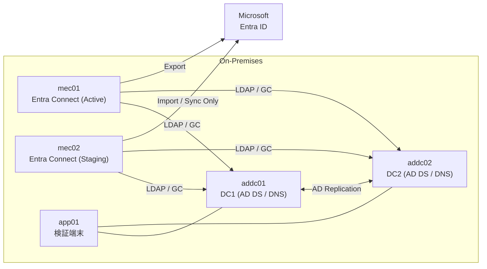

# Hybrid Identity 構成概要
Microsoft Entra Connect (Active / Staging 冗長構成)

---

## 1. 概要

本構成は、オンプレミスActive Directory と Microsoft Entra ID を統合するHybrid Identity 構成である。

Microsoft Entra Connect を使用し、オンプレADのユーザー情報をクラウドへ同期する。

---

## 2. 構成方針

| 項目 | 方針 |
| ---- | ---- |
| AD構成 | 単一フォレスト / 単一ドメイン |
| 同期方式 | Password Hash Synchronization (PHS) |
| SSO | Seamless SSO 有効 |
| 冗長構成 | Active / Staging 2台構成 |
| カスタム同期ルール | 使用しない (規定ルール) |

---

## 3. 全体構成



### 設計ポイント

- Activeは常に1台のみ稼働
- Staging は Import / Sync のみ稼働
- 障害時は Staging を Active 化
- Exportの同時実行は禁止
- ドメインコントローラーは 2台構成 (addc01 / addc02) とし、認証・DNS基盤の可用性を確保する
- addc01 / addc02 は AD DS / DNS を提供し、相互レプリケーションを行う
- クライアント/メンバーサーバーのDNS参照先は DC2台を優先/代替で設定する (単一障害回避)

---

## 4. サーバ構成

| サーバ | 役割 | OS |
| ------ | ---- | -- |
| addc01 | AD DS / DNS | Windows Server 2022 |
| addc02 | AD DS / DNS | Windows Server 2022 |
| mec01 | Entra Connect (Active) | Windows Server 2022 |
| mec02 | Entra Connect (Staging) | Windows Server 2022 |
| app01 | 検証端末 | Windows 11 |

- すべて固定IP
- DNS参照先はドメインコントローラー2台 (addc01 / addc02) を優先代替で設定する
- 単一障害点を排除し、名前解決の可用性を確保する
- TLS 1.2以上必須

---

## 5. AD設計

### ドメイン情報

| 項目 | 設定値 |
| ---- | ------ |
| ドメインFQDN | corp.local |
| NetBIOS名 | CORP |
| 機能レベル | Windows Server 2016以上 |
| FSMO | addc01 |

---

### DC冗長構成

| 項目 | 設計 |
| ---- | ---- |
| DC台数 | 2台 (addc01 / addc02) |
| DNS | 両DCでDNS提供 |
| Global Catalog | 両DCで有効 |
| FSMO | 原則 addc01 に集約 (初期構成) |
| 目的 | 認証基盤 (AD/DNS) の単一障害点を排除し可用性を確保 |

※将来的に可用性要件に応じてFSMO移動/分散も検討可能。

---

### UPN設計

| 項目 | 設定 |
| ---- | ---- |
| 規定UPN | corp.local |
| 追加UPN | corp.example.com |
| 使用UPN | corp.example.com |

#### 例：taro.yamada@corp.example.com

※ `corp.local`は non-routable のため、Entra ID 連携用にルーティング可能なUPNを使用。

---

### OU設計

| 区別 | OU | 同期 |
| ---- | -- | --- |
| 同期対象 | OU=SyncUsers | 有効 |
| 管理者 | OU=Admins | 無効 |
| サービス | OU=ServiceAccounts | 無効 |

---

## 6. Entra Connect 設計

### トポロジ

| サーバ | モード | Export |
| ------ | ----- | ------ |
| mec01 | Active | 実施 |
| mec02 | Staging | 実施しない |

---

### サインイン方式

| 項目 | 設定 |
| ---- | ---- |
| 方式 | Password Hash Synchronization |
| Seamless SSO | 有効 |
| ADFS | 未使用 |
| PTA | 未使用 |

---

### 同期対象

| オブジェクト | 同期 |
| ------------ | ---- |
| User | 有効 |
| Group | 有効 |
| Contact | 無効 |
| Device | 無効 |

#### OUフィルタ

| 区別 | OU | 同期 |
| ---- | -- | ---- |
| 同期対象 | OU=SyncUsers,DC=corp,DC=local | 有効 |
| 同期除外 | OU=Admins,DC=corp,DC=local | 無効 |
| 同期除外 | OU=ServiceAccounts,DC=corp,DC=local | 無効 |

> 上記以外のOUも同期対象外とする。

---

### 同期方式

| 区別 | 内容 |
| ---- | ---- |
| 自動同期 | 約30分間隔 (規定値) |
| 手動同期 | Delta Sync |

#### 手動実行コマンド

```powershell
Start-ADSyncSyncCycle -PolicyType Delta
```

## 7. ネットワーク要件

| 通信元 | 通信先 | ポート | 用途 |
| ------ | ----- | ------ | ---- |
| mec01/mec02 | addc01/addc02 | 389 (LDAP) / 636 (LDAPS) | LDAP |
| mec01/mec02 | addc01/addc02 | 3268 | Global Catalog |
| mec01/mec02 | Entra ID | 443 | Import / Sync / Export |
| app01 | Entra ID | 443 | サインイン確認 |

- mec01/mec02 は DC2台双方へ疎通可能であること (片方障害時も同期継続のため)

---

## 8. 切替設計

### 切替前

| サーバ | 状態 |
| ------ | ---- |
| mec01 | Active |
| mec02 | Staging |

### 切替後

| サーバ | 状態 |
| ------ | ---- |
| mec01 | Staging |
| mec02 | Active |

※ 切替後は必ず Delta Sync を実施する。

---

## 9. 特徴

- Microsoft推奨の基本Hybrid構成
- PHSによる最小構成
- OUフィルタによる誤同期防止
- Active / Staging 冗長構成
- 実務想定 (corp.local → routable UPN追加) 再現

---

## 10. 監視方針 (拡張想定)

本構成では、同期基盤の可用性および健全性を担保するため、
Microsoft Entra Connect Health の導入を前提とした設計とする。

Connect Health により、以下の監視を実施可能とする想定である。

- 同期状態監視 (Success / Failure)
-  Export エラー検知
-  削除数急増アラート
-  同期処理時間およびパフォーマンス監視
-  AD 接続状態監視

※本LAB環境ではライセンス制約により未実装とする。
本番環境では Microsoft Entra ID P1 以上のライセンスを前提に導入する。

---

## 11. 今後の拡張候補

- PTA構成
- ADFS構成
- 多フォレスト構成
- Entra Connect Health
- Exchange Hybrid


