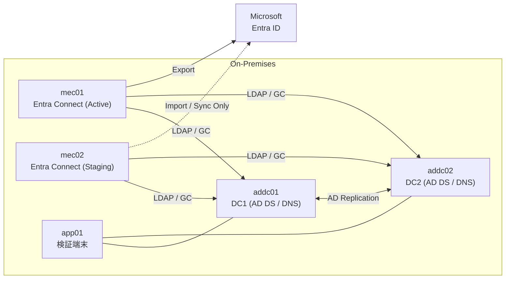

# 02_基本設計  
# Hybrid Identity / Microsoft Entra Connect

本文書は Microsoft Entra Connect を用いた Hybrid Identity 構成の基本設計を定義する。  
設計方針・前提条件・設計意図を明確化し、後続の詳細設計・構築手順・検証設計の基礎とする。

---
## 目次

1. [目的・ゴール](#1-目的ゴール)  
   - [1.1 目的](#11-目的)  
   - [1.2 ゴール（到達条件）](#12-ゴール到達条件)  

2. [適用範囲](#2-適用範囲)  
   - [2.1 対象範囲](#21-対象範囲)  
   - [2.2 対象外](#22-対象外)  

3. [前提条件・制約](#3-前提条件制約)  
   - [3.1 前提](#31-前提)  
   - [3.2 制約事項](#32-制約事項)  

4. [全体構成](#4-全体構成)  
   - [4.1 構成概要](#41-構成概要)  
   - [4.2 サーバ構成（VM）](#42-サーバ構成vm)  

5. [ネットワーク設計](#5-ネットワーク設計)  
   - [5.1 ネットワーク概要](#51-ネットワーク概要)  
   - [5.2 IP設計](#52-ip設計)  

6. [ID設計](#6-id設計)  
   - [6.1 ADドメイン設計](#61-adドメイン設計)  
   - [6.2 UPN設計](#62-upn設計)  
   - [6.3 OU設計](#63-ou設計)  

7. [Entra Connect 設計](#7-entra-connect-設計)  
   - [7.1 トポロジ](#71-トポロジ)  
   - [7.2 サインイン方式](#72-サインイン方式)  
   - [7.3 同期対象](#73-同期対象)  
   - [7.4 同期方式](#74-同期方式)  

8. [試験方針](#8-試験方針)  

9. [運用方針](#9-運用方針)  

10. [監視方針](#10-監視方針)  
   - [10.1 監視対象](#101-監視対象) 
   - [10.2 実装方針](#102-実装方針)  
   - [10.3 設計意図](#103-設計意図)  

11. [成果物管理方針](#11-成果物管理方針)  

12. [設計確定事項](#12-設計確定事項)

---

## 1. 目的・ゴール

### 1.1 目的

オンプレミス Active Directory（以下、オンプレAD）と Microsoft Entra ID を統合し、  
企業における標準的な Hybrid Identity 構成を設計・構築・検証する。

### 1.2 ゴール（到達条件）

1. オンプレADのユーザーが Entra ID へ同期されること（作成 / 更新 / 削除）  
2. Delta Sync の動作を確認できること（手動 / 自動）  
3. Connector Space / Metaverse にて同期オブジェクトの状態を確認できること  
4. Active（mec01）⇔ Staging（mec02）の切替ができ、切替後も同期が継続できること  

---

## 2. 適用範囲

### 2.1 対象範囲

- 単一フォレスト / 単一ドメインのオンプレAD  
- Microsoft Entra Connect（Active / Staging の冗長構成）  
- ユーザー同期（必要に応じてグループ同期を含む）  
- 冗長構成切替設計  

### 2.2 対象外

| 項目 | 理由 |
|------|------|
| ADFS 構成 | 本LABの検証スコープ外（将来拡張候補） |
| 多フォレスト・多ドメイン設計 | 単一構成での基本動作検証を優先 |
| Entra ID Connect Health 等の高度監視 | 本LABは基本同期動作の検証を主目的とする |
| MIM 等の他同期製品との連携 | Entra Connect 単体構成を優先 |

---

## 3. 前提条件・制約

### 3.1 前提

- Microsoft Entra ID テナントが利用可能であること  
- Entra ID 側に必要な管理者権限（Global Administrator）を有すること  
- すべてのサーバが相互通信可能であること  
- インターネット通信（HTTPS 443）が許可されていること  

### 3.2 制約事項

- 本構成は検証環境を前提とする
- 本構成においても最小限のバックアップおよび復旧方針を定義する
- 本番導入時には監査要件・バックアップ設計を別途検討する

### 3.3 バックアップ方針

- DCは System State バックアップ取得を前提とする
- Entra Connect 構成情報はエクスポートにより保全する
- VMレベルでのスナップショットは構築フェーズのみ利用し、運用フェーズでは恒常的利用は行わない

---

## 4. 全体構成

### 4.1 構成概要



- Active / Staging の2台構成により切替時の同期継続性を確保  
- 同時に Active を複数稼働させない（Export競合防止）  

### 4.2 サーバ構成（VM）

| サーバ | 役割 | OS | 備考 |
|--------|------|----|------|
| addc01 | AD DS / DNS (DC1) | Windows Server 2022 | ドメインコントローラ |
| addc02 | AD DS / DNS (DC2) | Windows Server 2022 | ドメインコントローラ |
| mec01 | Entra Connect（Active） | Windows Server 2022 | 同期実行主体 |
| mec02 | Entra Connect（Staging） | Windows Server 2022 | 切替待機サーバ |
| app01 | テスト端末 | Windows 11 | 動作確認用 |

- ドメインコントローラは2台構成とし、認証・DNS基盤の単一障害点を排除する。

---

## 5. ネットワーク設計

### 5.1 ネットワーク概要

- すべてのサーバは同一セグメント内に配置する
- DNS サーバは addc01 / addc02 を使用する (優先 / 代替)
- メンバーサーバおよびクライアントは DC2台を参照する
- DC自身は相互参照を基本とする (推奨)
- mec01 / mec02 はインターネットへ HTTPS（TCP 443）通信可能とする  

### 5.2 IP設計

本LAB環境では、すべてのサーバに固定IPアドレスを割り当てる。  
実際のIPアドレスおよびデフォルトゲートウェイは現在確認中であり、確定後に本書へ反映する。

| サーバ | IPアドレス | DNS | デフォルトGW | 備考 |
|--------|------------|------|---------------|------|
| addc01 | 172.16.1.50 | 自身 / addc02 | 172.16.1.1 | DNSサーバ |
| addc02 | 172.16.1.49 | 自身 / addc01 | 172.16.1.1 | DNSサーバ |
| mec01  | 172.16.1.51 | addc01 / addc02 | 172.16.1.1 | ドメイン参加 |
| mec02  | 172.16.1.52 | addc01 / addc02 | 172.16.1.1 | ドメイン参加 |
| app01  | 172.16.1.53 | addc01 / addc02 | 172.16.1.1 | クライアント |

#### 設計意図

- Entra Connect は Active Directory と安定した通信を行う必要があるため、固定IPとする。
- DNS参照先は addc01 に統一し、名前解決の一元管理を行う。
- ネットワークパラメータの最終確定値は「02_詳細設計」にて管理する。

---

## 6. ID設計

### 6.1 ADドメイン設計

| 項目 | 設計値 |
|------|--------|
| ドメイン名 | corp.local |
| NetBIOS名 | CORP |
| ドメイン機能レベル | Windows Server 2016 以上 |

設計意図：  
`corp.local` は non-routable ドメインであるため、  
Entra ID と統合する際にはルーティング可能な UPN サフィックスを別途追加する。

---

### 6.2 UPN設計

#### 背景

AD ドメインを `corp.local` で構築すると、既定UPNサフィックスは自動的に `corp.local` に設定される。
これは作成後に変更できない仕様であり、かつ `corp.local` は non-routable ドメインのため
Entra ID のサインインIDとしてそのまま使用することができない。

本LABでは、この制約を持つ既存オンプレAD環境を意図的に再現している。
実務では `corp.local` 等の non-routable ドメインで構築された既存ADに対して
後からEntra IDを統合するケースが多く、その対処方法の習得を目的としている。

<!-- 新規構築であれば最初からルーティング可能なドメイン名（例：corp.example.com）を
ドメイン名として採用することで、この手順は不要になる。
本LABは既存環境との統合パターンを意図的に選択している。 -->

#### 設計方針

`corp.example.com` を追加UPNサフィックスとして登録し、ユーザーへ割り当てる設計とする。
これにより既定UPNサフィックス（`corp.local`）の制約を回避し、Entra ID との整合性を確保する。

| 項目 | 設定値 |
|------|--------|
| 既定UPNサフィックス | `corp.local`（ADドメインFQDN・変更不可） |
| 追加UPNサフィックス | `corp.example.com`（ルーティング可能・手動追加） |
| 使用UPNサフィックス | `corp.example.com`（ユーザーへ割り当てるサフィックス） |

例：
```
taro.yamada@corp.example.com
```

Entra ID 側では `corp.example.com` を検証済みカスタムドメインとして登録することを前提とする。
これによりオンプレADとクラウド間でログインIDを統一し、ユーザー体験の一貫性を確保する。

---

### 6.3 OU設計

| 区分 | OU | 備考 |
|------|----|------|
| 同期対象 | OU=SyncUsers,DC=corp,DC=local | Entra Connect 同期対象 |
| 非同期 | OU=Admins,DC=corp,DC=local | 管理者アカウント |
| 非同期 | OU=ServiceAccounts,DC=corp,DC=local | サービスアカウント |

設計意図：

- 管理者・サービスアカウントを同期対象外としリスク低減  
- 同期範囲を明確化し誤同期を防止  
- 将来の拡張に対応可能な構造  

---

## 7. Entra Connect 設計

### 7.1 トポロジ

| サーバ | モード | StagingMode | 役割 |
|--------|--------|-------------|------|
| mec01 | Active | False | Import / Sync / Export |
| mec02 | Staging | True | Import / Sync のみ |

---

### 7.2 サインイン方式

| 項目 | 採用方針 |
|------|----------|
| サインイン方式 | Password Hash Synchronization（PHS） |
| Seamless SSO | 有効 |
| ADFS | 未使用 |
| PTA | 未使用 |

**採用理由：**  
本LABは Hybrid Identity の基本同期動作の検証を主目的とするため、  
追加コンポーネントを必要としない最小構成の PHS を採用した。  
PTA・ADFS は将来拡張候補とする。

---

### 7.3 同期対象

本LABでは、同期対象を明確に限定することで誤同期および不要オブジェクトのクラウド展開を防止する。

| オブジェクト | 同期有無 | 備考 |
|--------------|----------|------|
| User         | 有効     | OU=SyncUsers 配下のみ |
| Group        | 有効     | OU=SyncUsers 配下のみ |
| Contact      | 無効     | 本LAB対象外 |
| Device       | 無効     | 本LAB対象外 |

#### 設計方針

- OUフィルタにより同期範囲を `OU=SyncUsers,DC=corp,DC=local` に限定する。
- 管理者アカウントおよびサービスアカウントは同期対象外とする。
- 既定同期ルールを使用し、カスタム同期ルールは作成しない。
- 将来的な拡張（部門単位同期等）に対応可能な構造とする。

---

### 7.4 同期方式

本LABでは Microsoft Entra Connect の既定スケジューラを利用する。

| 区分 | 方式 | 備考 |
|------|------|------|
| 通常運用 | 自動同期 | 約30分間隔（既定値） |
| 手動同期 | Delta Sync | 構成変更後・切替後・障害復旧後に実施 |

#### 設計方針

- 通常運用時は自動同期により定期的に差分同期を実施する。
- 構成変更（OUフィルタ変更等）後は手動Delta同期を実施し、同期結果を確認する。
- StagingサーバをActiveへ切替後は、必ずDelta同期を実行し正常性を確認する。
- 具体的な実行手順および確認方法は「02_詳細設計」および「04_検証設計」に記載する。

---

## 8. 試験方針

1. ユーザー作成 → Entra ID 反映確認  
2. 更新・削除の反映確認  
3. OUフィルタ適用確認  
4. Connector Space / Metaverse エラーなし確認  
5. Active / Staging 切替後の同期確認  

---

## 9. 運用方針

- 障害時は mec02 を Active 化  
- 切替後 Delta Sync 実施  
- 手順は 05_切替設計 に記載  

---

## 10. 監視方針

本構成では、Hybrid Identity 基盤の可用性および同期健全性を担保するため、
Microsoft Entra Connect Health の導入を前提とした設計とする。

### 10.1 監視対象

> ※本LABでは想定ベースの設計とする

- 同期状態 (Success / Failure)
- Export エラー有無
- 大量削除検知 (Deletion Threshold 超過)
- 同期処理時間およびパフォーマンス状態
- AD 接続状態

### 10.2 実装方針

- 本LAB環境ではライセンス制約より未実装とする。
- 本番環境では Microsoft Entra ID P1 以上のライセンスを前提とし、
  Connect Health Agent を各同期サーバへ導入する。

### 10.3 設計意図

- 同期停止の早期検出
- 誤削除・誤同期の迅速な把握
- 運用フェーズにおける可観測性の確保

---

## 11. 成果物管理方針

| 取得対象 | 目的 |
|----------|------|
| Active / Staging 状態確認 | 切替証跡 |
| 同期成功ログ | 動作証跡 |
| Connector Space エラー確認 | 品質証跡 |
| Metaverse 確認結果 | 同期確認 |

---

## 12. 設計確定事項

| 項目 | 設計値 |
|------|--------|
| OS | Windows Server 2022 |
| ドメイン名 | corp.local |
| NetBIOS名 | CORP |
| 機能レベル | Windows Server 2016 以上 |
| 使用UPN | corp.example.com |
| 同期対象OU | OU=SyncUsers,DC=corp,DC=local |
| サインイン方式 | PHS + Seamless SSO |

---

IPアドレスおよびネットワーク詳細は  
02_詳細設計 にて定義する。
