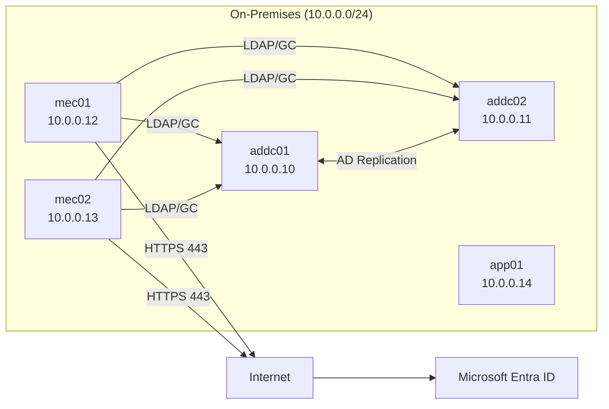

# 04_ネットワーク設計書  
Hybrid Identity / Microsoft Entra Connect

---

# 目次

1. [目的](#1-目的)  
   1.1 [作成目的](#11-作成目的)  
   1.2 [本設計書の位置付け](#12-本設計書の位置付け)  

2. [適用範囲](#2-適用範囲)  
   2.1 [対象範囲](#21-対象範囲)  
   2.2 [対象外範囲](#22-対象外範囲)  

3. [ネットワーク構成概要](#3-ネットワーク構成概要)  
   3.1 [物理・論理構成概要](#31-物理論理構成概要)  
   3.2 [ネットワーク前提条件](#32-ネットワーク前提条件)  
   3.3 [アドレス体系方針](#33-アドレス体系方針)  

4. [IPアドレス設計](#4-ipアドレス設計)  
   4.1 [IPアドレス一覧](#41-ipアドレス一覧)  
   4.2 [固定IP採用方針](#42-固定ip採用方針)  
   4.3 [デフォルトゲートウェイ設計](#43-デフォルトゲートウェイ設計)  

5. [DNS設計](#5-dns設計)  
   5.1 [DNS参照設計](#51-dns参照設計)  
   5.2 [ドメインコントローラのDNS設計方針](#52-ドメインコントローラのdns設計方針)  
   5.3 [名前解決可用性設計](#53-名前解決可用性設計)  

6. [通信要件設計](#6-通信要件設計)  
   6.1 [Active Directory関連通信](#61-active-directory関連通信)  
   6.2 [グローバルカタログ通信](#62-グローバルカタログ通信)  
   6.3 [ADレプリケーション通信](#63-adレプリケーション通信)  
   6.4 [クラウド通信要件](#64-クラウド通信要件)  
   6.5 [クライアント通信要件](#65-クライアント通信要件)  

7. [通信フロー設計](#7-通信フロー設計)  
   7.1 [通常同期フロー](#71-通常同期フロー)  
   7.2 [Delta同期フロー](#72-delta同期フロー)  
   7.3 [Active / Staging切替時フロー](#73-active--staging切替時フロー)  

8. [インターネット接続設計](#8-インターネット接続設計)  
   8.1 [接続方式](#81-接続方式)  
   8.2 [必要ポート要件](#82-必要ポート要件)  
   8.3 [TLS要件](#83-tls要件)  
   8.4 [Inbound通信不要設計](#84-inbound通信不要設計)  

9. [セキュリティ設計](#9-セキュリティ設計)  
   9.1 [ファイアウォール制御方針](#91-ファイアウォール制御方針)  
   9.2 [最小権限通信設計](#92-最小権限通信設計)  
   9.3 [Deletion Threshold設計](#93-deletion-threshold設計)  

10. [可用性設計](#10-可用性設計)  
    10.1 [ドメインコントローラ冗長化](#101-ドメインコントローラ冗長化)  
    10.2 [グローバルカタログ冗長化](#102-グローバルカタログ冗長化)  
    10.3 [Entra Connect冗長構成](#103-entra-connect冗長構成)  
    10.4 [DNS冗長設計](#104-dns冗長設計)  

11. [障害時動作設計](#11-障害時動作設計)  
    11.1 [DC障害時動作](#111-dc障害時動作)  
    11.2 [Entra Connect障害時動作](#112-entra-connect障害時動作)  
    11.3 [インターネット遮断時動作](#113-インターネット遮断時動作)  

12. [設計パラメータ一覧](#12-設計パラメータ一覧)  
    12.1 [ネットワークパラメータ](#121-ネットワークパラメータ)  
    12.2 [通信ポート一覧](#122-通信ポート一覧)  
    12.3 [セキュリティパラメータ](#123-セキュリティパラメータ)
    
---

# 1. 目的

本書は、Hybrid Identity（Microsoft Entra Connect Active / Staging 構成）における  
ネットワーク設計を定義するものである。

- 各サーバ間の通信要件の明確化  
- インターネット接続要件の明確化  
- セキュリティ制御方針の定義  
- 単一障害点の排除設計の明示  

---

# 2. 適用範囲

## 対象範囲

- オンプレミス検証環境（vSphere 上のVM）
- Active Directory ドメイン環境
- Microsoft Entra Connect（Active / Staging）
- Microsoft Entra ID との通信

## 対象外

- Azure VNet設計
- 拠点間WAN設計
- 多サイトAD設計
- Proxy経由設計（本構成では未使用）
- OU設計・同期対象定義 (03_詳細設計書 2.3節 および 4.4節 を参照)

---

# 3. ネットワーク構成概要

## 3.1 構成イメージ

## 3.2 ネットワーク前提

| 項目 | 内容 |
|------|------|
| IPセグメント | 10.0.0.0/24 |
| デフォルトGW | 10.0.0.1 |
| VLAN | 検証用専用VLAN |
| NAT | あり（Outbound通信のみ） |
| グローバルIP | 不要（Outbound通信のみ） |

---

# 4. IPアドレス設計

## 4.1 アドレス一覧

| サーバ | IPアドレス | サブネット | GW | 用途 |
|--------|------------|------------|----|------|
| addc01 | 10.0.0.10 | /24 | 172.16.1.1 | DC/DNS |
| addc02 | 10.0.0.11 | /24 | 172.16.1.1 | DC/DNS |
| mec01 | 10.0.0.12 | /24 | 172.16.1.1 | Entra Connect Active |
| mec02 | 10.0.0.13 | /24 | 172.16.1.1 | Entra Connect Staging |
| app01 | 10.0.0.14 | /24 | 172.16.1.1 | 検証端末 |

---

## 4.2 設計方針

- すべて固定IP  
- DHCP未使用  
- Entra Connect サーバはIP変更不可（証跡管理観点）  

---

# 5. DNS設計

## 5.1 DNS参照設定

| サーバ | 優先DNS | 代替DNS |
|--------|---------|---------|
| addc01 | 10.0.0.10 | 10.0.0.11 |
| addc02 | 10.0.0.11 | 10.0.0.10 |
| mec01 | 10.0.0.10 | 10.0.0.11 |
| mec02 | 10.0.0.10 | 10.0.0.11 |
| app01 | 10.0.0.10 | 10.0.0.11 |

---

# 6. 通信要件一覧

## 6.1 AD関連通信

| 通信元 | 通信先 | プロトコル | ポート | 用途 |
|--------|--------|------------|--------|------|
| mec01/mec02 | addc01/addc02 | TCP | 389 | LDAP |
| mec01/mec02 | addc01/addc02 | TCP | 636 | LDAPS |
| mec01/mec02 | addc01/addc02 | TCP | 3268 | Global Catalog |
| addc01 | addc02 | TCP | 135 + 動的 | ADレプリ |

---

## 6.2 クラウド通信

| 通信元 | 通信先 | プロトコル | ポート | 用途 |
|--------|--------|------------|--------|------|
| mec01 | Entra ID | TCP | 443 | Export |
| mec02 | Entra ID | TCP | 443 | Import/Sync |
| app01 | Entra ID | TCP | 443 | サインイン確認 |

---

# 7. 通信フロー設計

1. AD Import（389/3268）  
2. Delta Sync（内部処理）  
3. Export（443）※Activeのみ  

---

# 8. インターネット接続設計

| 項目 | 内容 |
|------|------|
| 接続方式 | 直接インターネット接続 |
| Proxy | 未使用 |
| 必須ポート | TCP 443 |
| TLS | 1.2以上 |

※ Inbound通信は不要。

---

# 9. セキュリティ設計

- 外向きTCP 443のみ許可  
- 内部通信は必要ポートのみ許可  
- 不要ポート遮断  

## Deletion Threshold

| 項目 | 値 |
|------|----|
| Threshold | 500（既定値） |

---

# 10. 可用性設計

| 項目 | 設計 |
|------|------|
| DC | 2台構成 |
| GC | 両DC有効 |
| Entra Connect | Active / Staging |
| DNS | 冗長 |

---

# 11. 障害時動作設計

## DC1障害

- DC2へ自動フェイル  
- DNS解決継続  

## mec01障害

- mec02をActive化  
- Delta Sync実施  

## インターネット遮断

- 同期停止  
- ADは継続稼働  

---

# 12. 設計パラメータ一覧

| 項目 | 値 |
|------|----|
| セグメント | 172.16.1.0/24 |
| GW | 10.0.0.1 |
| DNS | addc01/addc02 |
| クラウド通信 | TCP 443 |
| LDAP | TCP 389 |
| GC | TCP 3268 |
| TLS | 1.2以上 |

